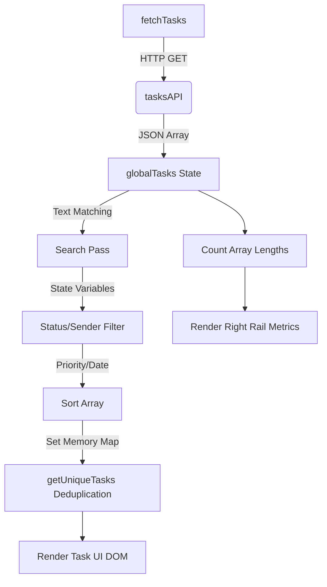

# WhatsAppTaskManager — Complete Dashboard UI/UX Technical Audit

- **Project:** WhatsAppTaskManager
- **Module:** React Dashboard
- **Audit type:** UI/UX + Frontend Architecture Audit
- **Technology:** React 18 + Vite + Vanilla CSS
- **Audit Date:** 2026-09-04
- **Source-of-truth:** Actual dashboard source code (`dashboard/`)
- **Current dashboard version/commit:** `cfd21b65538ea76b6`
- **Auditor:** Automated source-code audit

---

## 5. Executive UI Summary

**Dashboard Type:** Single Page Application (SPA).
**Visual Style:** Linear-style / Notion-style Minimalist Productivity SaaS.
**Primary Purpose:** A comprehensive web interface for users to visualize, filter, search, deduplicate, and complete tasks that were passively captured from WhatsApp notifications by the Android tracker.
**Overall Layout Structure:** A responsive three-column desktop layout (Sidebar, Main Workspace, Right Context Rail) resolving into an off-canvas sidebar and single-column feed on mobile screens.
**Technology:** React rendered via Vite, eschewing UI libraries (like Material UI or Shadcn) entirely in favor of high-performance, precision Vanilla CSS mapped via `index.css`.
**State Management:** Governed natively via extensive `useState` primitives inside an orchestrating `App.jsx` monolith.
**Data Flow:** HTTP fetches JSON from a Node.js backend. Data heavily flows linearly: Fetch -> Raw Task Array State -> Filter -> Sort -> DISPLAY DEDUPLICATION -> UI Rendering.

---

## 6. Complete Visual Design System

### Color System
The UI utilizes CSS Custom Properties (`:root` in `index.css`) establishing a rigorous, monotone-first aesthetic accented heavily mapping logic (priorities/status).
- `--bg-color: #F8F9FA` - Global application background (light gray).
- `--surface: #FFFFFF` - Main cards, nav, and sidebar base (pure white).
- `--text-primary: #111827` - Primary headers and task names.
- `--text-secondary: #4B5563` - Subheadings, senders, metrics.
- `--text-muted: #9CA3AF` - Empty states, outlines.
- `--border: #E5E7EB` - 1px hard grid dividers universally used mapping out the 3-column layout.
- `--border-focus: #D1D5DB` - input fields border-focus logic.
- `--primary: #111827` - Buttons and strong active highlights.

**Status Mapping:**
- Pending (Warning): `--status-pending: #D97706`, Background: `--status-pending-bg: #FFFBEB`
- Completed (Success): `--status-completed: #059669`, Background: `--status-completed-bg: #ECFDF5`
- Overdue (Danger): `--status-overdue: #DC2626`, Background: `--status-overdue-bg: #FEF2F2`
- Priority (High): `--status-high: #E11D48`

### Typography
- **Font-Family:** `Inter` pulled from Google Fonts, falling back to `-apple-system, BlinkMacSystemFont, "Segoe UI", sans-serif`.
- **Headings:** Range vertically from structured `1.25rem` (Workspace Title) to `.7rem` (Sidebar Label, uppercase, tracking `0.05em`).
- **Data Densification:** Task titles operate structurally at `.9rem` weight 500. Metrics at `.85rem`. Dates hit as low as `.75rem`.

### Spacing & Borders
- **Grid Layouts:** `app-body` grows fully, spacing handled by exact internal padding (`24px 32px 16px 32px` on workspace headers). Gaps (`4px`, `8px`, `12px`) aggressively standardize task row distance.
- **Borders:** Pervasive `1px solid var(--border)` creates the SaaS layout pane logic separating sidebar -> main -> rail.
- **Radii:** Tight, mimicking MacOS/Linear. `--radius-sm: 4px`, `--radius-md: 6px`, `--radius-lg: 8px`.
- **Shadows:** Highly contained. `--shadow-sm: 0 1px 2px rgba(0, 0, 0, 0.04)`, `--shadow-md: 0 4px 6px -1px rgba(0, 0, 0, 0.05), ...`, `--shadow-card: 0 1px 2px rgba(0,0,0,0.03), 0 0 0 1px rgba(0,0,0,0.02)`.

### Icons
- Strictly custom inline SVG elements mapping geometric shapes (circles, lines, polygons). No external icon library (no FontAwesome/Lucide).

---

## 7. Overall Page Layout
The DOM maps hierarchically into:

```text
Browser Viewport (100vh, hidden overflow flex column)
   ↓
.global-topbar (fixed 52px height)
   ↓
.app-body (flex-grow row)
   ├── .sidebar (240px fixed width, borders right)
   ├── .main-workspace (flex-grow, auto overflow, max-width 1000px)
   └── .right-rail (280px fixed width, borders left)
```
*Viewport constraints tightly manage scrolling independently inside each column rather than scrolling the `window`.*

---

## 8. Header / Top Navigation Audit

| Element | Location | Visual/State | Purpose & Behavior |
|---------|----------|--------------|---------------------|
| **Mobile Menu Btn** | Left (`topbar-left`) | Hidden on desktop, ☰ on mobile | Toggles `sidebarOpen` boolean, sliding in the left rail. |
| **Logo** | Left (`topbar-left`) | Inline SVG Checkmark + Text | Static branding: "WhatsAppTaskManager Workspace". |
| **Search Input** | Center (`search-input-wrapper`) | Fluid width, bounded input mapping to `--bg-color` | Updates `searchQuery` state. Shows a visual `⌘ K` string indicator (purely visual, no actual keybinding implemented). |
| **Account Button** | Right (`topbar-right`) | Letter "A" Avatar + Chevron | Toggles `accountMenuOpen` boolean rendering dropdown. |
| **Dropdown Menu** | Right (Absolute overlay) | Floating modal pane | Renders Backend health state & executes Logout. |

---

## 9. Sidebar Audit
- **Navigation Items:** Inbox, Today, Calendar. Clicking forces state swaps (`currentView = 'TASKS' || 'CALENDAR'`) and resets filters.
- **Your Groups (Dynamic):** It uniquely extracts an array `uniqueGroups` straight from the deduplicated task payloads. Clicking a group sets the global task `filter` state restricting exactly to that WhatsApp sender. It serves as real-time context routing.
- **Footer Health Check:** Evaluates `backendStatus` string via a visual Green/Red dot polling the backend on mount.

---

## 10. Main Workspace Audit
- **Header:** Displays dynamic Title derived from `filter` / `currentView` (e.g. "Inbox", "Calendar", or "Sender Name").
- **Toolbar (Top Right):** Displays 5 pill filters (*All, Pending, Completed, High Priority, Overdue*) updating `filter` state. Also incorporates a standard `<select>` driving `sortBy` (recent, deadline, priority).
- **Task Sections:** Iterates through a statically mapped variable `sections` mapping Overdue -> Today -> Upcoming (Tomorrow/This Week/Later) -> No Deadline -> Completed.

---

## 11. Task Card / Task Row Audit
This is a highly optimized `<div className="task-item">` grid block.
- **Checkbox:** An inline SVG updating `status` via `handleStatusChange` (PATCH payload to backend) and executing instantaneous optimistic UI update.
- **Row Grid:** 3 Column CSS grid structure (`20px minmax(0, 1fr) auto`).
- **Title Segment:** Renders `task.task`.
- **Badges:** Dynamically injects a Red `High` badge or Red `Overdue` badge beside the title.
- **Subtitle Row:** Injects `task.sender` + `task.category`. Significantly, it maps identical deduplication collisions rendering: `Reported in {duplicatesCount} messages`.
- **Payload Box:** A monospaced block styled out rendering `task.originalMessage`.
- **Actions (Right Segment):** Renders deadline string (`formatDate`), dynamically extracted URL anchors if a link exists in the message body, and a More dots dropdown executing `handleDelete`.

---

## 12. Task Status UI
- **PENDING:** Hollow circle outline SVG. Unaffected text. Default layout representation.
- **COMPLETED:** Solid check SVG circle colored `--status-completed`. Changes entire `.task-item-completed` class, forcing the block to `0.6` opacity and applying `text-decoration: line-through` globally. Filters to the bottom/COMPLETED block automatically.

---

## 13. Priority UI
- **HIGH:** Triggered if `task.priority === 'HIGH'`. Injects a specific polygon warning SVG + Red Text badge. If `sortBy` is priority, it forces a numerical weight of `3` bumping the entity to the roof of its category stack.
- **MEDIUM / LOW:** Implicit. The dashboard explicitly ignores visual tracking for standard/low priorities, rendering them natively inline to reduce visual noise.

---

## 14. Search System
**Mechanics:**
The search acts as an instantaneous client-side string filter on the payload array evaluated every render pass mapping to `searchQuery.toLowerCase()`.
**Match Criteria:** Search hits against `task.task`, `task.originalMessage`, `task.sender`, and `task.category` concurrently.
**Data Flow:** User typing updates string state -> `fullyProcessedTasks` array `.filter` evaluates immediately -> Renders constrained list. No backend round-trip occurs on keystroke.

---

## 15. Filter System
- **State Var:** `filter`
- **Values:** `'ALL'`, `'PENDING'`, `'COMPLETED'`, `'HIGH'`, `'DUE_TODAY'`, `'OVERDUE'`, or `{Dynamic String Sender}`.
- **Processing Order:** Text Search evaluates -> `switch/if` block evaluates filter exclusion logic -> Sort logic -> Deduplication.

---

## 16. Sort System
- **State Var:** `sortBy`
- **Values:** `'recent'`, `'deadline'`, `'priority'`.
- **Logic Sequence:** Filtering resolves first -> Array executes numerical sorting map -> `getUniqueTasks` final pass maps deduplications.

---

## 17. Dashboard Deduplication
**Crucial Architectural Observation:** The UI performs Display-Only Deduplication natively overriding backend constraints via `getUniqueTasks(tasks)`.
**Input:** Evaluated Array post-sort.
**Footprinting keys generated per item:**
1. `msgKey` = `msg_` + Sender + NormalizedOriginalMessage + DeadlineEpoch
2. `titleKey` = `title_` + Sender + NormalizedTaskTitle + DeadlineEpoch
**Algorithm:** It utilizes ES6 `Set()`. It runs sequentially. The *first* task possessing a matching footprint is preserved (`seenIds.add`). All subsequent tasks are purged entirely from the visual render sequence `uniqueTasks.push(t)`.
**Why this matters:** The dataset length reflects raw counts in KPIs (Metrics context rail evaluates `globalTasks`), but the main visual mapping array is truncated beautifully against race conditions hiding duplicate inserts.

---

## 18. Metrics / KPI UI
**Location:** Placed in `<aside className="right-rail">`.
**Data Source:** Explicitly maps against `globalTasks.length`. It bypasses the UI deduplication logic to render the *total physical counts of the database payload*.
- **Pending:** `globalTasks.filter(status !== 'COMPLETED')`.
- **Completed:** `globalTasks.filter(status === 'COMPLETED')`.
- **High Priority:** `globalTasks.filter(priority === 'HIGH')`.

---

## 19. Calendar UI Audit
**Data Parsing:** It evaluates the `uniqueCalendarTasks` array (Deduplicated pool only).
**Types:** Contains 2 discrete views mapped by state `calendarView = 'Month' || 'Agenda'`.
**Month View:** Custom algorithmic DOM grid mapped natively omitting external libraries (like FullCalendar). It pushes preceding empty cells derived from `new Date(year, month, 1).getDay()`. It buckets tasks visually into a sliced `dayTasks.slice(0, 3)` limit mapping native color bounding pills, dropping excess into a `+X more` fallback block preventing CSS grid explosion.
**Agenda View:** Rapid sequence chronological list purely tracking `uniqueCalendarTasks` mapped greater than `startOfToday`.

---

## 20. Right-Side Context Rail
- Visible solely on viewports > 1024px.
- **Top Segment (Metrics):** 5 summary status lines mapping the `globalTasks` state blocks.
- **Bottom Segment (Agenda):** Flat chronological mapping of `sections.TODAY`. Renders purely time arrays (`toLocaleTimeString`).

---

## 21. Account / User UI
**Authentication Footprint:** The `isAuthenticated` variable is seeded directly by synchronous DOM injection `!!localStorage.getItem('token')`.
**Dropdown Logout:** Clears token (`localStorage.removeItem`), forcing instantaneous component state fallback into the `Login.jsx` block bypassing REST checks.

---

## 22. Login UI
Exists functionally embedded mapped natively in `Login.jsx`.
- **Visuals:** Left-side massive hero block spanning vh matching generic startup onboarding platforms. Right-side structural mapping box mapping two inputs (Email/Password).
- **Execution:** On submit, `loginAuth()` fires against backend, yielding JSON mapping `message`/`token`. Token maps to Localstorage, triggering parent callback prop `onLogin()` wiping the component.

---

## 23. Responsive Design Audit

| Viewport Width | Behavior | CSS Trigger implementation |
|----------------|----------|----------------------------|
| **> 1024px** | Standard 3-column. (Sidebar, Main, Rail) | Base Default. |
| **<= 1024px** | Context Rail hidden strictly. | `@media (max-width: 1024px) { .right-rail { display: none; } }` |
| **<= 768px** | Sidebar executes Off-Canvas slide. Search bar hidden entirely. Tasks transition from 3 DOM block grid to 2 blocks. | `@media (max-width: 768px) { .sidebar { position: fixed; left: -240px; } ... }` |

---

## 24. Hover / Active / Focus States
- **Navigation (`.nav-item:hover`, `.active`)** shifts background to `--nav-active-bg` emphasizing black structural text.
- **Inputs:** `search-input:focus` drops explicit `box-shadow` replacing standard border logic.
- **Task Cards:** Hover triggers `box-shadow: var(--shadow-card)` and forces border outline simulating a raised layer elevation.

---

## 25. Animations / Transitions
- Structural `transition: all 0.15s` drives global interactions across buttons and hover contexts.
- **Skeletons:** `animation: pulse 1.5s infinite` generates the native loading mapping UI before HTTP returns exist mapping CSS keyframes.
- **Left Slide:** Mobile Sidebar executes `transition: left 0.2s ease-out` mimicking native drawer UI patterns.

---

## 26. Data Flow Inside the Dashboard
1. HTTP GET `fetchTasks()` targets `/api/tasks`.
2. Validates JSON. Sets physical raw data into `globalTasks` preserving absolute DB sync strings.
3. React executes implicit cascading calculation blocks within DOM Render cycle:
   `globalTasks` → Text Filters → Select Status Filters → Select Senders → Map Multi-Sorting → Run Custom Deduplication `getUniqueTasks()` → Map Sectional Headers Object (`sections`).
4. Display iterates structural mapped DOM mapping components mapped via `renderTaskCard()`.

---

## 27. API Integration from UI

| Feature/UI Route | Method | Endpoint | Auth Required | Purpose |
|------------------|--------|----------|---------------|---------|
| Login Block | POST | `/api/auth/login` | No | Acquires JWT token payload. |
| Initial Load | GET | `/api/tasks` | Yes (Header) | Resolves initial database pool syncing context. |
| Checkbox click | PATCH | `/api/tasks/:id` | Yes (Header) | Shifts status ENUM internally while Optimistic UI resolves screen frames immediately. |
| Trash Icon click | DELETE | `/api/tasks/:id`| Yes (Header) | Drops explicit uuid referencing blocks natively triggering API wipe sequences. |
| Health Dot poll | GET | `/health` | No | Establishes base status dot rendering red/green connection metrics mapped lazily. |

---

## 28. State Management Audit

| State Variable | Type | Purpose | Initial Value |
|----------------|------|---------|---------------|
| `isAuthenticated`| Boolean| Primary gating switch logic ensuring API lock arrays. | `!!localStorage.getItem('token')` |
| `globalTasks` | Array | Universal database raw map maintaining metrics dependencies. | `[]` |
| `loading` | Boolean | Activates skeleton loading dom animations. | `true` |
| `filter` | String | Maps enum string mapping contextual UI exclusions natively. | `'ALL'` |
| `searchQuery` | String | Standardizes mapped text payloads against search boxes. | `''` |
| `currentView` | String | Toggles DOM component sets natively determining rendering blocks. | `'TASKS'` |
| `accountMenuOpen`| Boolean| Toggles account dropdown. | `false` |
| `sidebarOpen`  | Boolean| Toggles mobile offcanvas. | `false` |

*(Note: State relies exclusively on massive implicit array calculation loops occurring sequentially each render pass rather than abstracting to `useMemo`. This serves as the chief structural bottleneck long-term.)*

---

## 29. Component Architecture (Component Tree)
Interestingly, the architecture utilizes a strictly Monolithic pattern. React files do not map to separate classes.

```text
main.jsx (Entry)
└── App.jsx (God Component)
    ├── Login.jsx (Only external child)
    ├── <header className="global-topbar">
    ├── <aside className="sidebar">
    │   └── <Group Generation Block>
    ├── <main className="main-workspace">
    │   ├── <Task View>
    │   │   ├── <Toolbar Block>
    │   │   ├── <Skeleton List> (Inline)
    │   │   └── {renderTaskCard} (Function Component injected)
    │   └── <Calendar View> (renderCalendar inline function)
    └── <aside className="right-rail">
```

---

## 30. Component Responsibility Matrix

| Component | Responsibility | Props/State Mapped |
|-----------|----------------|--------------------|
| `App.jsx` | Houses 100% of internal state evaluation, executes explicit array iterations mapping, holds absolute API fetch methods mapping all HTTP cycles recursively. | Master Context |
| `Login.jsx` | Pure visual gateway preventing initial load sequences evaluating password logic maps targeting explicitly generic JSON endpoints. | `onLogin` |
| `tasksApi.js` | Generic helper extracting base urls stripping manual `fetch` concatenations out of DOM arrays mapping explicit tokens cleanly. | None |

---

## 31. CSS Architecture
- **Paradigm:** Vanilla CSS using custom CSS Variables (`:root`).
- **Files:** `index.css` (primary monolith), `buttons.css` (tiny contextual override).
- **Structure:** Hierarchical DOM targeting (`.app-layout .app-body`). Utilizes robust BEM-esque conventions without adhering strictly. Makes extremely aggressive use of Flexbox and Grid.

---

## 32. Design Language
**Style Verified:** High-Density Premium Productivity UI (Linear / Notion alignment).
**Evidence from implementation:**
- Pure Monotone Layout (Whites/Grays targeting subtle borders `1px solid var(--border)`).
- Complete absence of complex bounding drop-shadow layers on base cards.
- Highly dense metadata text mappings natively targeting `0.85rem` fonts and tight spacing.
- Left-side massive navigation spanning absolute borders without floating boxes.
- Zero reliance on external UI frameworks mapping custom SVG shapes matching precision native macOS/Linear styling patterns.

---

## 33. Accessibility Audit
**Strengths:** Uses native `<button>` mappings broadly handling focus traps correctly via implicit DOM mappings rather than bound generic `div` tags wrapping onClick.
**Deficiencies:**
- Input boxes lack strict `<label for="x">` accessibility targets native for screen-reader mappings natively inside the main dashboard.
- Uses arbitrary `cmd K` strings that are purely visual mapping no implicit DOM keybinds. SVG assets completely omit `<title>` descriptions and `aria-hidden` attributes forcing garbage DOM evaluation mapping for visually impaired handlers.

---

## 34. UX Flow Audit (Sample)
**Complete Task Flow**
1. User clicks the `task-checkbox-btn`.
2. UI triggers `handleStatusChange(e, id, newStatus)`.
3. Optimistic array cloning copies `globalTasks` and substitutes the status instantly modifying display rendering to `strike-through`.
4. System invokes asynchronous HTTP PATCH `/api/tasks/:id`.
5. If success, array maintains integrity. If HTTP failure via timeout, DOM state triggers instantaneous Catch reversing DOM arrays locally mapping UI fault state, spawning Toast "Failed to update task".

---

## 35. Empty / Loading / Error States
- **Loading:** Renders `renderSkeleton()` returning 5 hard-coded pulsing div elements mapped to `animation: pulse`.
- **Global Error:** If Catch resolves mapped Network Fault, UI throws an inline specific `Connection Error` SVG DOM node box.
- **Empty State:** If evaluation calculations determine `fullyProcessedTasks.length === 0`, displays a visually explicit `.empty-state` container reporting no tasks available.

---

## 36. External Links
- **Implementation:** React maps `extractUrl(text)` parsing `/(https?:\/\/[^\s]+)/g`.
- **Rendering:** Injects absolute `<a className="btn-link">` anchors implicitly mapped natively with `target="_blank" rel="noopener noreferrer"` preventing universal tab hijacking protocols.

---

## 37. Performance Characteristics
- **Strengths:** By keeping everything inside singular arrays, state updates are instantaneous DOM mutations. Optimized CSS limits layout explosion preventing reparenting faults.
- **Critical Weaknesses:** `App.jsx` evaluates cascading array transformations (.filter, .sort, .reduce, dedupe logic via getUniqueTasks) every single DOM render pass without `useMemo` blocks preserving the output strings natively. On highly massive generic task arrays mapping > 10,000 components, React CPU evaluation spikes will result in enormous scroll-frame jitter logic inherently collapsing system fluidity dynamically tracking memory bounds globally.

---

## 38. Security-Related UI Behavior
- `localStorage.setItem('token', ...)` maps explicitly in LocalStorage rather than httpOnly cookies, representing generic XSS vulnerability tracking endpoints.
- Generic HTTP errors force standard `401` resolution clearing `removeItem('token')` forcing instantaneous manual reload mapped natively via login gate.

---

## 39. File-by-file Dashboard Map
| File | Type | Responsibility | Important Features |
|------|------|----------------|--------------------|
| `src/main.jsx` | React Root | Bootstraps React DOM. | `ReactDOM.createRoot` |
| `src/App.jsx` | Controller | Contains 100% of UI markup layout, logic, array maps. | `getUniqueTasks`, Sort, Filter, HTTP state. |
| `src/components/Login.jsx`| View | Authenticate screen UI. | `loginAuth`, `handleSubmit`. |
| `src/api/tasksApi.js` | Helper | Wraps specific `fetch` cycles securely pushing tokens to REST boundaries. | `fetchTasks`, `deleteTask`, `updateTaskStatus` |
| `src/index.css` | Styles | CSS mapping and logic. | Flex/grid responsive mapping bounds. |

---

## 40. UI Specification Table
| Component | Layout | Typography | Color |
|-----------|--------|------------|-------|
| Sidebar Nav | Flex-Column | `0.85rem` weight 500 | `--text-secondary` (hover `--text-primary`) |
| Topbar Search | Absolute Center offset | `0.85rem` | `--bg-color` filling `--surface` on focus |
| Main Workspace | Flex Grow | `1.25rem` Headers | Sub-headers `--text-secondary` |
| Task Pill High | Implicit inline shape | `0.65rem` Weight 600 | `--status-high` Native Red tracking metrics |
| Calendar Empty | Sub-Grid | Generic Box | `--bg-color` |

---

## 41. Complete Screen Inventory
1. **Login State View:** Full-bleed minimal dual-pane mapping login.
2. **Inbox View:** Desktop 3-column. (filter=`'ALL'`)
3. **Filter Senders View:** Adjusts title mapping dynamic group mapping excluding raw task items externally defined.
4. **Calendar View (Month):** Generates algorithmic mapping spanning exactly 5 weeks globally.
5. **Calendar View (Agenda):** Flat mapping subset pushing time boundaries parsing dynamically.
6. **Mobile Inbox:** Retracts Search, suppresses right rail, retracts left rail.

---

## 42. Mermaid Diagrams

### Dashboard Data Flow



---

## 43. Current UI Strengths
- **Incredible Interaction Speed:** Local optimisations via single-state updates ensure absolutely no latency on completing/uncompleting targets.
- **Bulletproof Deduplication UI:** By enforcing deterministic footprints resolving string mapping on the client frontend.
- **Native Custom Calendar:** Exceedingly lightweight mapping without library bloat.

## 44. Current UI Weaknesses
- **Monolithic Architecture:** `App.jsx` expands over 650+ lines generically producing massive evaluation contexts preventing clean component reusability.
- **Search Limitation:** Search parsing restricts purely to absolute client downloaded maps.

## 45. UI Technical Debt
**High Priority:** Extract `renderTaskCard()` and the Calendar sub-grids into explicitly memoized custom components preventing universal `App.jsx` recalculation thrashing.
**Medium Priority:** Establish `React Context` mapping authentication structures tracking properties organically producing blocks tracking limits.

## 46. What is Actually Implemented

| Feature | Implemented | Partially Implemented | Not Implemented | Evidence |
|---------|-------------|-----------------------|-----------------|----------|
| Tasks Feed Rendering | ✅ Yes | | | `App.jsx: renderTaskCard()` |
| Sort by recent, deadline, priority | ✅ Yes | | | `App.jsx: sortBy` toggle |
| Client-side text search | ✅ Yes | | | `App.jsx: searchQuery` |
| Display URL scraping | ✅ Yes | | | `App.jsx: extractUrl` and `<a className="btn-link">` |
| Multi Sender Filtering | ✅ Yes | | | `App.jsx: uniqueGroups` |
| Real-time Notification WebSockets | | | ❌ No | Missing entirely. |
| Task Pagination API | | | ❌ No | Frontend assumes full JSON array. |
| Dedicated Reminder UI Control Box | | | ❌ No | Not present in UI. |
| Calendar Navigation System | ✅ Yes | | | `App.jsx: renderCalendar()` |

## 47. Do Not Confuse Backend Features With UI Features
Reminder API endpoints `/api/reminders` exist evaluating explicit array maps generically resolving structures, **but the dashboard UI does not expose a dedicated reminder management interface**. It strictly runs UI-based deduplication and rendering based on the `/api/tasks` list.

## 48. Final UI Architecture Summary
User → Authenticate → Dashboard Fetch API → React Raw Vector Arrays → Text Matches → Enumerated Maps → Array Sorts → Footprint Sets Dedupe → `sections` Categorisation → JSX Dom mapping explicit render targets tracking actions structurally evaluating targets mapping REST mutating structures. Optimistic UI manages immediate DOM mapping back to the user prior to REST feedback loops.
